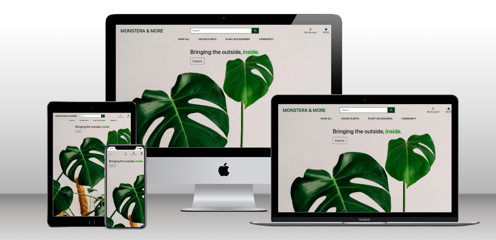
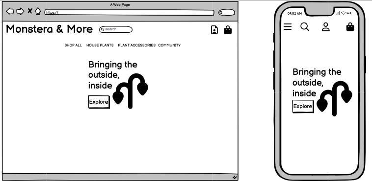
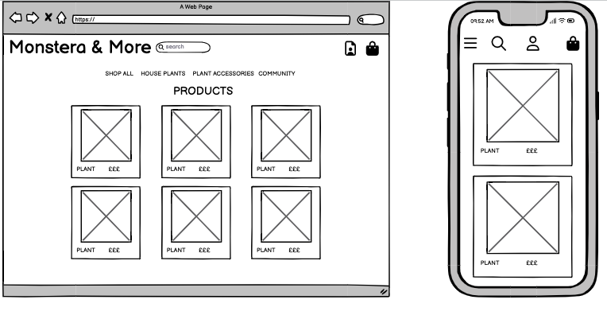
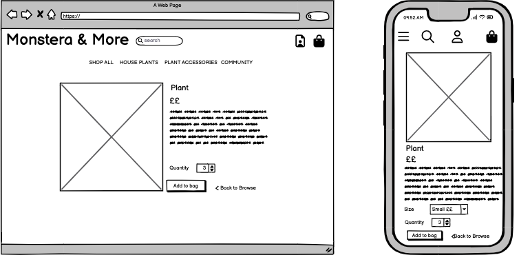
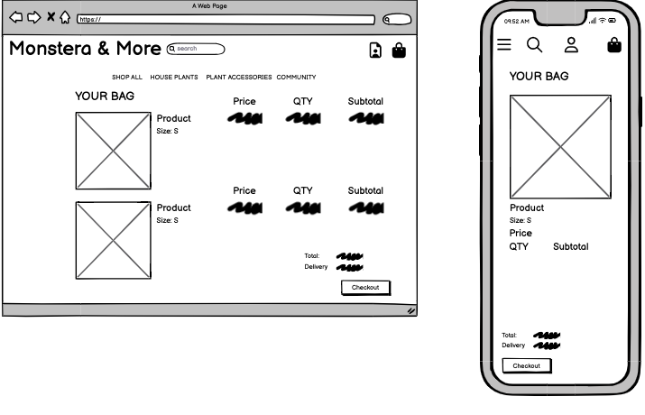
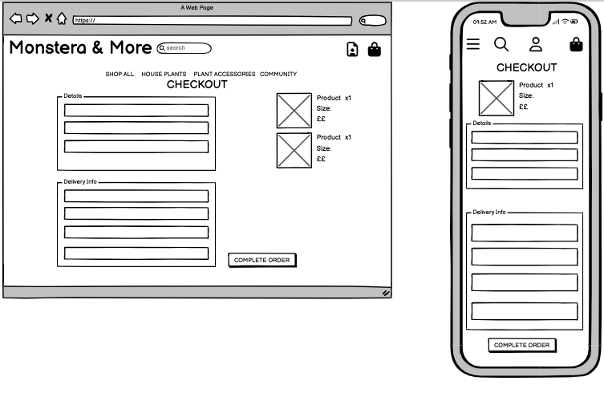
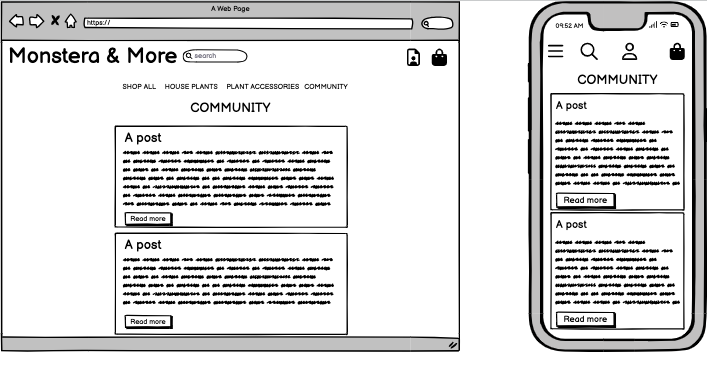
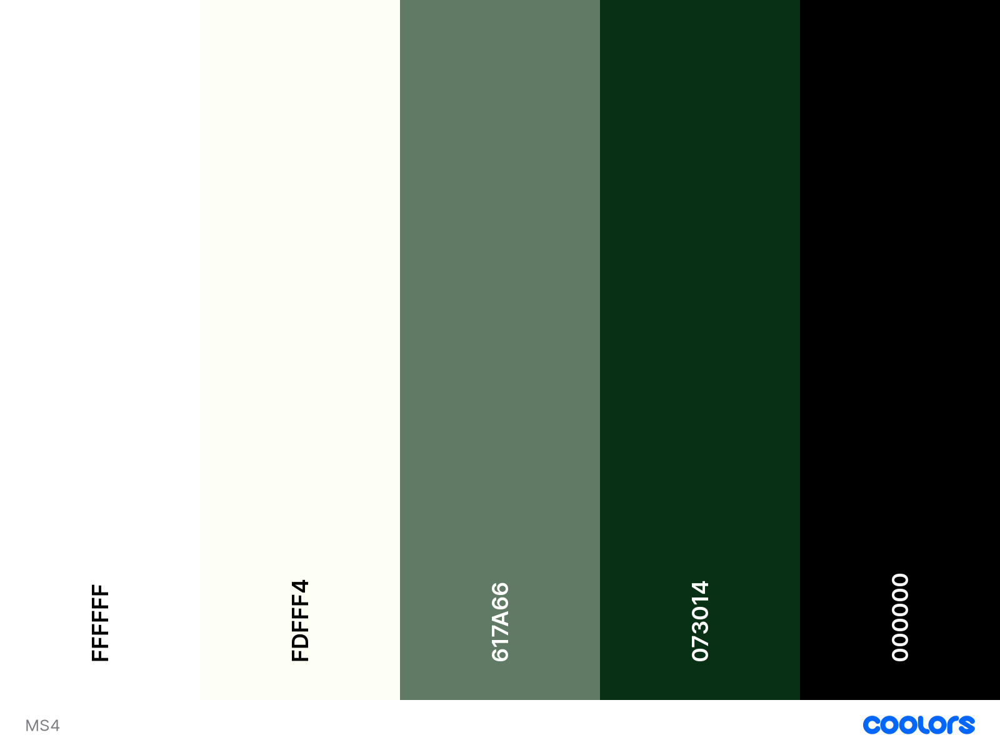
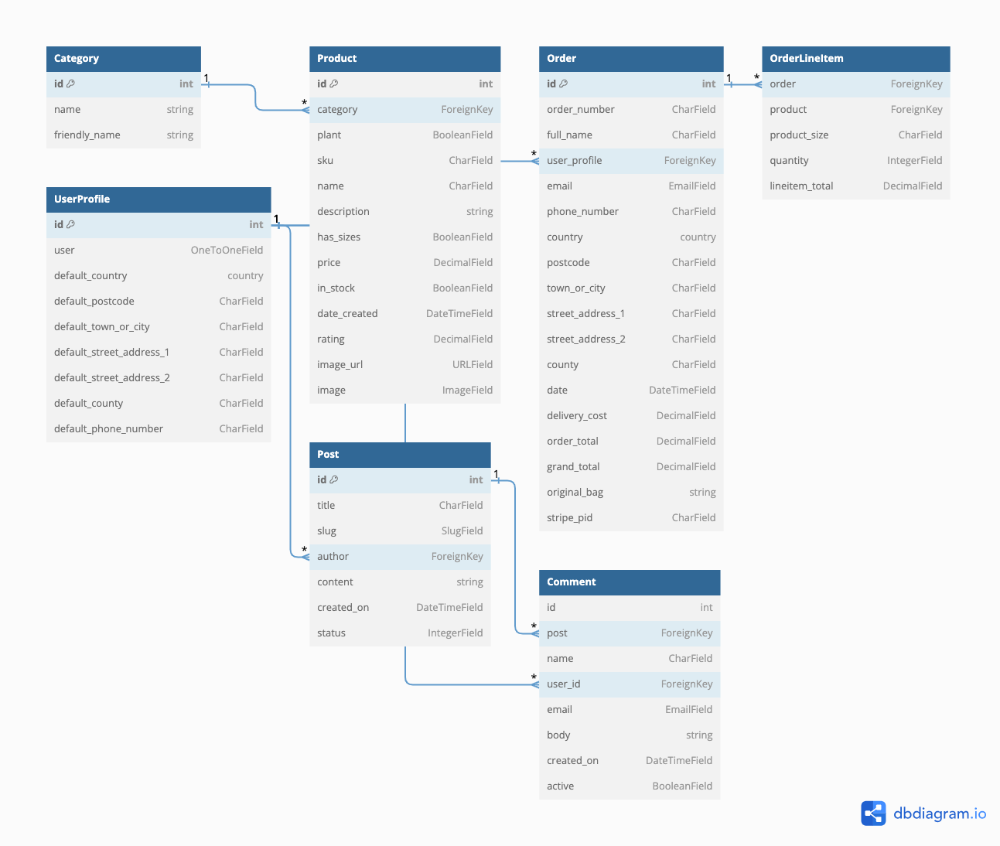

## Monstera & More 

[Link to live website](https://monstera-and-more-c7bad93be933.herokuapp.com/)

---

## **About**

**Milestone 4 project - Full Stack Frameworks with Django - Code institute**

Monstera & More is an e-commerce site that sells houseplants. Users can browse and purchase products, as well as sign up to become a member and leave comments on blog posts. 

### Project Focus
The goal of this project is to build a full-stack site with business logic, controlling a centrally-owned dataset. The project will have an authentication mechanism and there will be paid services/purchases available to the user.

---

## Table of Contents
- [User experience (UX)](#ux)     
    - [User stories](#user-stories)
    - [Strategy](#strategy)
    - [Scope](#scope)
    - [Structure](#structure)
    - [Skeleton](#skeleton)
    - [Surface](#surface)
- [Features](#features)
- [Technologies used](#technologies-used)
- [Testing](#testing)
- [Deployment](#deployment)
- [Credits](#credits)

---

## **UX**

User experience

### **User stories**

### **As a new user I want ...**
- To understand what the sites purpose is immediately.
- To be able to register to become a member, giving me the ability to leave comments on posts and save my delivery information.
- To easily browse products, add items to my bag, checkout securely, and receive an email confirmation of my purchase.
- To be able to search the site to see if a certain product is available.
- To see if a particular product is out of stock 

### **As a returning user I want ...**
- To have my details saved so that checkout is quicker.
- To be able to update my details if they have changed, e.g. address.
- To be able to view my order history, so if i want to order the same product again, i know exactly which one it was.

### **As the site owner I want ...**
- To be able to add, update and delete products.
- Provide 404 and 500 error pages to redirect users back to the homepage.
- Approve any comments or posts before they are added.
- To attract new users and retain existing users to ultimately sell more products.

---

### Strategy
The following questions were asked when developing a strategy...
- Who is the target audience?
    - The target audience is anyone who likes to keep houseplants, or is interested in learning more about what houseplants could be best for them.
- Is the technology appropriate for the user and the purpose of the website?
    - The technology is intuitive and straightforward to allow users to quickly browse and purchase products.
- How is the offering of this site different from competitors?
    - Users can browse the 'community' section and if logged in can leave comments and interact with other users, discussing houseplant tips and more.

From the above questions, the focus for the strategy will be on the following:
- Develop a site that where it is clear what type of products are being sold, and it is simple to sign up to become a memeber.
- Ensure the technology is straightforward and relevant to the target audience.
- Increase return users back to the site, by having the option to view what products are most recently added, so they can see what is new easily.

---

### Scope
The scope of this website is to provide...
- Clear and user friendly navigation around the site
- Ability for users to use secure registration and login
- A checkout app that provides a secure payment system and email confirmation
- A search feature to allow users to browse products
- A blog app where users can read posts and add comments if logged in

---

### Structure

The website is organised by a hierarchical tree structure. This is a standard structure used commonly, and it reduces complexity. This structure can sometimes provide problems in regards to the navigation bar when displayed on mobile devices, however including the burger toggle bar, solves this.

The structure can be broken down into:
- Base - each page features a navigation bar which has links to the whole site, the logo of the site and a search bar.
- Home page - Features a large image with a title and a link to explore the products of the site.
- Products pages 
    - All products page - displays products, this can be narrowed down to just plants or just accessories. Also each page can be sorted by price, name, category, and date added.
    - Individual product page - displays the product image and info, and allows users to add to their bag
- Bag page - This displays any products that have been added to the users bag. They can delete or edit the quantity of each item. The subtotal, delivery cost and grand total is displayed. There is a link to progress to the checkout.
- Checkout page - A form is displayed for the users details and delivery detais, if they are logged in and have updated their details this will be pre-filled out for them. There is also a form input for card details. On the right hand side there is a summary of what they are ordering. While the checkout is processing a green overlay and a loading symbol will show, followed by a success page where their order summary will be displayed.
- Community pages - All of the blog posts are displayed on one page, to read the full blog post however a user must click on 'read'. This will load the full blog post and display any comments that have been made on this post. If a user is logged in they can add a comment. 
- Product Management Pages - An admin can view this to add a new product, which will load a form with all the necessary fields. An admin can also edit or delete a product from clicking on the link next to the individual products.
- Login Page - A user can login with their username and password. A success message will be displayed if succesful, if password or username is incorrect a message to explain this will be displayed.
- Logout Page - When a user clicks to logout, a page will load asking if they are sure they want to logout and two buttons will be displayed to choose from. A success message will be displayed when succesfully logged out.
- Register Page - A form is displayed containing the following fields; email address, email address confirmation, username, password, and password confirmation. An email will then be sent to the user with a link to follow to confirm the email address. Once this has been clicked the user can then log back in with those details. 

---

### Skeleton

- A base template was created to ensure the navigation bar was present on each page.
- Bootstrap was used throughout, this aided in ensuring all content was displayed appropriately on any device.

#### Wireframes

Changes made throughout development
- Here is some text. Here is some text. Here is some text. Here is some text. 

---

### Surface

#### Colour

- #FFFF - the colour of the search bar
- #FDFFF4 - the main background colour of the whole site
- #617A66 - used for some text 
- #073014 - used for logo, text and backgroung of some buttons
- #000000 - used for some text

The colour theme I chose for the site reflects the whole brand of Monstera and More, house plants. I wanted to keep it fairly muted with green accents throughout.

#### Imagery

The background image of the home page is a monstera plant - obviously linking to the name of the site. It is not over the top however and maintains the simple style that is present across the site.

Ideally I would have got all of the product images from the same photographer to have excellent continuity however I could not find someone who had a big enough range of suitable plants/plant accessories. The product images accurately fit the product it is linked to.
 

#### Typography 
The font is from Google fonts

- 'Lato'  
    - Used throughout the site. A clean, crisp font.

---

## Features

### Register/login
Users can register or login using a username and password. Django Allauth was utilized to handle securely registering users. An alert will show if the password is not strong enough, and users must confirm their password twice. Users cannot register with a username that is already taken. Users must click the link in the confirmation email when registering. When logged in there is a success message to welcome the user.

### Profile page
Logged in users can view their profile page. This displays their default delivery details in a form which can be edited and updated. Also displayed is any previous orders made by the user.

### Products pages
Users can view various pages including shop all, plants and plant accessories, each of these can then be viewed as separate categories or sorted by name, price, rating, or date added. 

### Community page
The community page displays blog posts created by admin, each post can be clicked on to view the full post. If logged in users can add comments. All comments need to be reviewed by admin before being published.

### Deleting comments
The admin account can delete any comments to allow monitoring. However all comments need to be approved by admin anyway but there may be a reason why they need to be deleted after publishing too. 

### Adding, editing and deleting products
The admin account can add new products using a form which also allows the upload of an image for the product. The same form can be loaded of an existing product where anything can be edited. There is a link within each product for the admin to edit or delete a product. Success messages are displayed when any of the aforementioned actions are taken. 

### Log out
Within the navbar there is a link to click to log out, this then asks the user if they are sure they want to logout, and then will load a success message to confirm to the user that they succesfully logged out.

### Search bar
Users can search the products on the site, it searches the title and the description of the product. If no searches are found a message will be displayed to indicate this. 

### Accessibility
- Text size, font and colour were considered in a way to hopefully provide clear, easy reading.
- The Lighthouse report looks at accessibility, see [Testing](#testing) section for more information. 

### Meta data
Meta tags are included within the head element, including a description, the author and keywords, to improve search engine optimisation. 

### 404 error page 
A custom 404 error page was added, including a link to redirect back to the home page.

### 500 error page 
A custom 500 error page was added, including a link to redirect back to the home page.

### Future features to consider

#### Different prices for different sizes 
Realistically larger sizes of the same plant would cost more, I couldn't manage to add this feature in but if it was to function as a real e-commerce site this would be important. 

#### Community 
The ability to attach images to blog posts and comments. Also for users to be able to delete their own comments, but obviously not others, as currently only the admin can delete comments. 

#### Favourites
A great addition to the site would be for the user to be able to 'favourite' products and then they could review their favourites and move any products they want to purchase into their bag.

#### Automatic Stock Status
Keep track of the exact number of stock of each item, this would allow a function where a product was purchased, the stock would be decremented by 1, and then the out of stock message would automatically display for the user. In addition to this when stock is below 5 items, a message could be displayed such as "Hurry they are almost gone!". 

---
## Database Schema 
- [Elephant SQL](https://www.elephantsql.com/) has been used for the storage of data for this site, it is a relational databse.
- I used [dbdiagram](https://dbdiagram.io/home) to create a visualisation of my database schema. The database is made up four collections. 

---

## Technologies used

### Languages
- [HTML5](https://en.wikipedia.org/wiki/HTML5) - a markup language used for presenting and structuring content.
- [CSS3](https://en.wikipedia.org/wiki/CSS) - stylesheet language for adding style.
- [Python3](https://www.python.org/) - a high-level, general-purpose programming language.
- [JavaScript](https://en.wikipedia.org/wiki/JavaScript) - language used to created dynamic and interactive programmes

### Programs and websites
- [GitHub](https://github.com/) - to host the repository.
- [GitPod](https://gitpod.io) - to write the code and use GIT to commit and push to GitHub.
- [Heroku](https://www.heroku.com/platform) - to deploy the project to a live site.
- [ElephantSQL ](https://www.elephantsql.com/) - used as the database platform.
- [Stripe](https://stripe.com/gb) - To handle card payments
- [Django Allauth](https://django-allauth.readthedocs.io/) - To handle user account management
- [AWS](https://aws.amazon.com/) - To store static and media files
- [Balsamiq](https://balsamiq.com/) - used to produce the wireframes.
- [dbdiagram](https://dbdiagram.io/home) - used to create a diagram for the database schema.
- [Coolors](https://coolors.co/) - used to create a colour palette for the website.
- [Techsini](https://techsini.com/multi-mockup/index.php) - used to create the multi device mockup.
- [W3C HTML Validation service](https://validator.w3.org/) - used to validate HTML
- [W3C Jigsaw CSS Validation service](https://jigsaw.w3.org/css-validator/) - used to validate CSS
- [JSHint](https://jshint.com/) - used to check the JS
- [Lighthouse](https://developer.chrome.com/docs/lighthouse/overview/) - for performance testing.
- [Chrome developer tools](https://developer.chrome.com/docs/devtools/) - for testing responsiveness throughout.

### Frameworks and Libraries 
- [Bootstrap](https://materializecss.com/) - version 4.4.1 was used throughout. Bootstrap documentation was used to create the basic design of the site and aid with responsiveness on all devices.
- [Django](https://www.djangoproject.com/) - a high-level Python web framework that encourages rapid development and clean, pragmatic design.
- [JQuery](https://jquery.com/) - for adding interactivity to components within the site.
- [Google Fonts](https://fonts.google.com/) - used to import fonts. 
- [Font Awesome](https://fontawesome.com/) - for icons throughout the site.
- [Image resizer](https://imageresizer.com/) - used to resize all product images to be equal in size.

---

## Testing 
Click [here](testing.md) to view all testing carried out.

---

## Deployment

### Access to this code
1. Go to **My repositories**.
2. Select **bethanyalicehall/memory-final**.
3. At the top of the page click on **Code**, where **Zip files** can be downloaded locally.

### Django
1. Run <code>pip3 install 'django<4'</code> in the terminal.
2. Then <code>django-admin startproject nameofproject</code>.
3. The django folder will then appear in the sidebar.
4. Ensure that <code>*.sqlite3 and *.pyc and pycache</code> are added to gitignore
5. Enter <code>python3 manage.py runserver</code> in the terminal, and load on port 8000. The page will show a message saying 'The install worked successfully! Congratulations!'.
6. To quite the server enter <code>CTRL + C </code> in the terminal.
7. Migrate files <code>python3 manage.py migrate</code> 
8. Create a superuser <code>python3 manage.py createsuperuser. Provide username, email and password.</code>
9. To save this in the terminal enter  
- <code>git add .</code> 
- <code>git commit -m "Your Commit message"</code> 
- <code>git push</code> 

### Stripe
1. Register for a Stripe account.
2. Go to 'Developers' tab on the dashboard
3. Go to 'API Keys' to view public and secret key.
4. Add the STRIPE_PUCLIC_KEY AND STRIPE_SECERET_KEY and STRIPE_WH_SECRET to the config vars in your Heroku settings. (See Heroku deployment steps below).

### ElephantSQL
To create a database:
1. Go to ElephantSQL.com and select create a new instance.
2. Name it the same name of your project.
3. Select the region closest to you then Create Instance
4. On the ElephantSQL dashboard, click on the database for this project
5. Copy the database URL and paste into the config vars in Heroku. (See Heroku deployment steps below).

### AWS
1. Create a Amazon AWS account.
2. Open S3 application and create a bucket. Select an AWS Region.
3. Allow all public access by unticking the  'Block All Public Access' setting.
4. In 'Properties' turn on 'Static Website Hosting' and set index.html and errors.html values.
5. In 'Permissions', click 'Edit' on the CORS configuration.
6. Edit 'Bucket Policy' and generate and set configuration 'Bucket Policy'.
7. Go to 'Access Control List' and set the permission to everyone
8. Open the IAM application and create a user group. Create a new Policy.
9. Click on the JSON tab and import an Amazon pre-built policy - AmazonS3FullAccess.
10. Navigate to 'Groups' and then attach the policy. Click 'Add User' and create one. Add the user to that group and download the CSV with the user's access credentials.
11. Add the AWS code into settings.py with USE_AWS as the environment variable. 

### Steps taken to deploy project to Heroku
1. Within the root directory add a Procfile and type inside this file <code>web: gunicorn shop.wsgi:application</code>. There must not be any blank lines or added spaces.
2. In the command line run <code>pip3 freeze > requirements.txt</code>, this will create a file called requirements.txt.
3. Ensure within the settings.py file that debug is set to False. 
4. Add both of these files and push them to your github repository.
4. Login or create an account on [Heroku](https://www.heroku.com/platform).
5. Create a new app
6. From your dashboard, click on the deploy tab and then connect the app to your GitHub repository, you can enable automatic deploys so that you do not need to manually deploy each time you make changes.
7. Within the settings on your heroku project, add the following config vars within settings.
    - <code>("IP", "0.0.0.0")</code>
    - <code>("PORT", "5000")</code>
    - <code>("AWS_ACCESS_KEY_ID", "A UNIQUE KEY")</code>
    - <code>("AWS_SECRET_ACCESS_KEY", "A UNIQUE KEY")</code>
    - <code>("DATABASE_URL", "URL FROM ELEPHANTSQL")</code>
    - <code>("HEROKU_POSTGRESQL_PURPLE_URL", "A UNIQUE KEY")</code>
    - <code>("SECRET_KEY", "A UNIQUE KEY")</code>
    - <code>("STRIPE_PUBLIC_KEY", "A UNIQUE KEY FROM STRIPE")</code>
    - <code>("STRIPE_SECRET_KEY", "A UNIQUE KEY FROM STRIPE")</code>
    - <code>("STRIPE_WH_SECRET", "A UNIQUE KEY FROM STRIPE")</code>
    - <code>("USE_AWS", "TRUE")</code>

Each of the above will have <code>os.environ.get</code> before the brackets.
8. Back in Heroku, from the dashboard click on settings. Set the config vars matching your code in the env.py file
9. To check it is working, manually deploy the project, from the deploy page, this takes a few minutes.
10. Click open app. 
11. If there are any errors, view the log to identify the problem.

---

## Credits 

### Media
Click [here](media-sources.md) to see details of images used.

### Content
- [Code institute boiler template](https://github.com/Code-Institute-Org/gitpod-full-template) was used.
- [Code institute - Boutique ado project]() - After following through the Boutique Ado project, a lot of the code for the products, bag and checkout app was taken from this project and edited to fit my own site. 
- [Django Central - building a blog app](https://djangocentral.com/building-a-blog-application-with-django/) - I followed through this and used the code to help me build my blog app, it was edited slightly to fit best with my site.
- [Django Central - creating a comments system](https://djangocentral.com/creating-comments-system-with-django/) - Utilized this to help build the comments model within my blog app. 
- [Wikipedia](https://github.com/Code-Institute-Org/gitpod-full-template) was used to help write the descriptions of each plant.
- For each blog post, the reference is included at the bottom of the post itself.

  
### Acknowledgements
I would like to thank
- Code institute tutors - they helped me fix various problems throughout the development of this project
- Manu Perez college supervisor, for all of his help and guidance.
- The photographers who publish royalty free images on Unsplash and Pexels that allowed me to use high quality imagery throughout.
- All of the code institute team, for providing quality learning content to allow me to develop my skills to complete this project.

---