# Testing

## HTML validator
I inputted my HTML into the W3C Markup Validation service. The only error that came up initially was to remove the type attribute for the JavaScript script tags. 

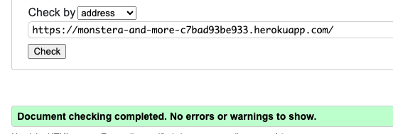

## CSS validator
I inputted code into the W3C validation service and no errors were found

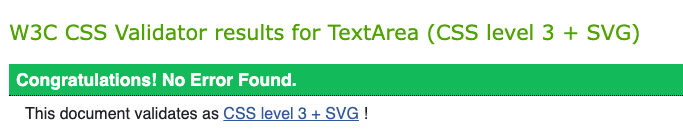

## JS validator

I used [JSHint](https://jshint.com/).
This gave some information of the following metrics, warnings and undefined variables. The warnings do not directly impact the functioning of the site or cause a console error.

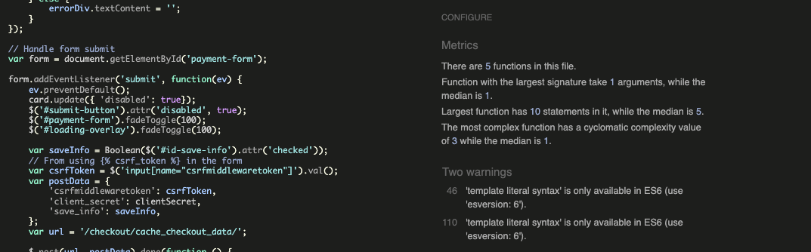

## PEP8 Compliant 
I ensured that my Python code was PEP8 compliant, I used Flake8 and corrected any linting errors within the IDE. I referred to [this site](https://peps.python.org/pep-0008/) to check some rules regarding indentation.

Below are some screenshots of linting errors, mainly due to indentation errors.

## Performance testing
I utilised the [Lighthouse](https://developer.chrome.com/docs/lighthouse/overview/) performance testing software.
- The results of the lighthouse testing can be seen below. 

### Home page
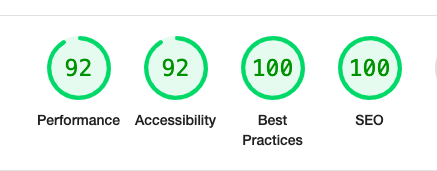

### Products page
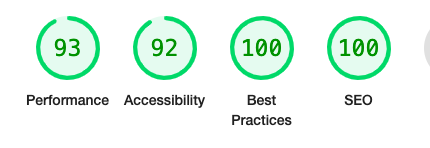
- Initially the accessibilty was in the orange, but I added the recommended ARIA labels and that fixed it.

### Products detail page
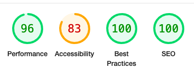
- It flagged up the buttons that had symbols e.g. the + and - for the quantity, and also the search symbol. This is because they are not compatible with screen readers. I will look into this for future projects to avoid reducing accessibilty.

### Bag page
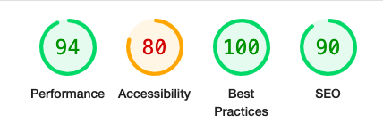
- Again, as above, it flagged up the buttons that had symbols because they are not compatible with screen readers. 

## Responsiveness
- I utilised Chrome Developer tools to test responsiveness on different devices, the following devices were sucesfully tested through this.
    - iPhone SE
    - iPhone XR
    - iPhone 6/7/8
    - Samsung galaxy S8+
    - iPad Mini
    - Surface pro 7
    - Galaxy Fold
    - Nest Hub

- I tested the website on an iPhone 12 pro, an iPad 2 and a MacBook Air.

## Manual testing

### Functional testing

#### Testing elements on each page 

| Page | Element and expected action | Pass or Fail | 
| ----------- | ----------- | ----------- |
| All pages | There is a navigation bar displaying the logo "Monstera&More" and navigation links, which all take you to the relevant page | Pass |
| All Pages | When viewing on smaller screens the navigation bar is displayed as a sidenav with a burger menu | Pass |
| All Pages | When hovering over a link the pointer changes | Pass |
| All Pages | The website is responsive on desktop, tablet and mobile | Pass |
| Home page | url linked in README.md displays Monstera&More homepage | Pass |
| Home page | The register link takes you to the registration page | Pass |
| Home page | The login link takes you to the login page | Pass |
| Login page | The login page works succesfully and only allows registered users to login | Pass |
| Login page | The password is hidden | Pass |
| Login page | A success message is displayed when a user logs in | Pass |
| Register page | The password is hidden  | Pass |
| Register page |  A success message is displayed when a user registers | Pass |
| Register page |  A confirmation email is sent | Pass |
| Register page |  The link on the confirmation email works | Pass |
| Logout page |  Clicking the link to logout brings up a page to ask 'Are you sure you want to logout?' | Pass |
| Logout page |  If they choose to logout, a success message is displayed | Pass |
| Profile page | The default delivery information is saved from previous sessions  | Pass |
| Profile page | The default delivery information can be updated and a success message displays when it is succesfully updated | Pass |
| Profile page | The order history for that user is displayed | Pass |
| Products page | The user can search products in the navbar and the relevant products will be shown | Pass |
| Products page | If there are no products matching the search, a link to browse products will be displayed | Pass |
| Products page | All products displayed are relevant to the category selected | Pass |
| Products page | The sort dropdown works correctly | Pass |
| Product detail page | All the relevant information is displayed about each product | Pass |
| Product detail page | The size can be selected for each product | Pass |
| Product detail page | The user can add the product to the bag and a pop-up will appear showing the current bag total | Pass |
| Bag page | A summary of the products in the users bag are dispalyed | Pass |
| Bag page | A user can edit or delete products in the bag | Pass |
| Bag page | A user can view the grand total and delivery cost breakdown, and a link to the checkout page is functioning correctly. | Pass |
| Checkout page | A form is displayed to fill out delivery details and payment | Pass |
| Checkout page | If a user is logged in and has ordered previously and selected 'save details' their details will be pre-filled | Pass |
| Checkout page | Any incorrect details in the form for delivery or payment will be flagged up | Pass |
| Checkout page | As the payment is processing an overlay with a loading symbol loads | Pass |
| Checkout page | On successful payment the user will be taken to the checkout success page where an order summary is displayed | Pass |
| Checkout page | On successful payment the user will be sent a confirmation email | Pass |
| Community page | All blog posts are displayed, and a 'read' button is present to allow users to read more | Pass |
| Community page | Only logged in users can add comments, if they are logged out the option to login will be dislayed | Pass |
| Community page | Once a user has submitted a comment, a message will display informing them that admin have to approve and to check back later | Pass |
| Community page | There is the option for an admin to delete a comment and this works | Pass |

### Browser compatibility
The following browsers were used to check compatibility with the website
- Chrome
- Safari
- Microsoft Edge

## Testing User Stories

### As a new user I want ...
- To understand what the sites purpose is immediatley.
    - The imagery, the site name and the text on the homepage all indicate the website is an e-commerce site selling houseplants. 

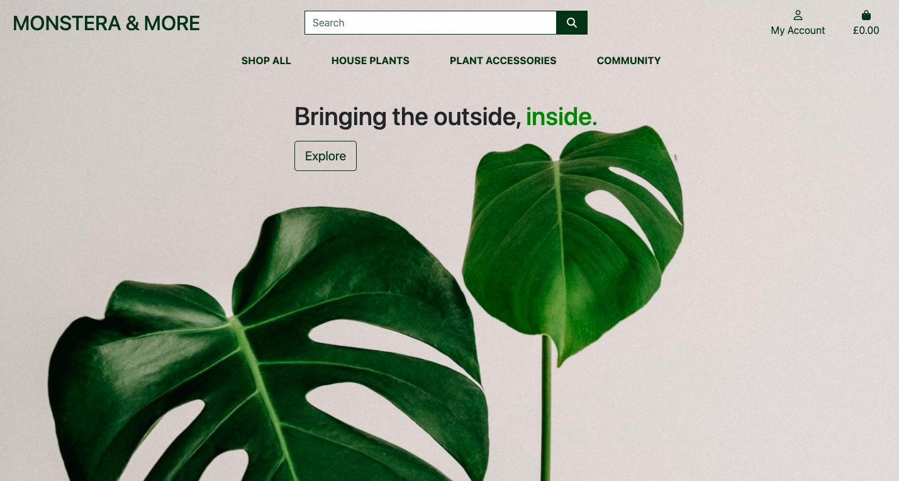

- To be able to register to become a member, giving me the ability to leave comments on posts and save my delivery information.
    - There are various points to prompt a user to register for an account including; 
        - From any page when clicking on the 'My Account" link on the nav bar. 
        - If a user wants to leave a comment, a message will be displayed to offer them to login or register.
        - When a user is checking out beneath their delivery details form, there is an option to login or register to be able to save their details.

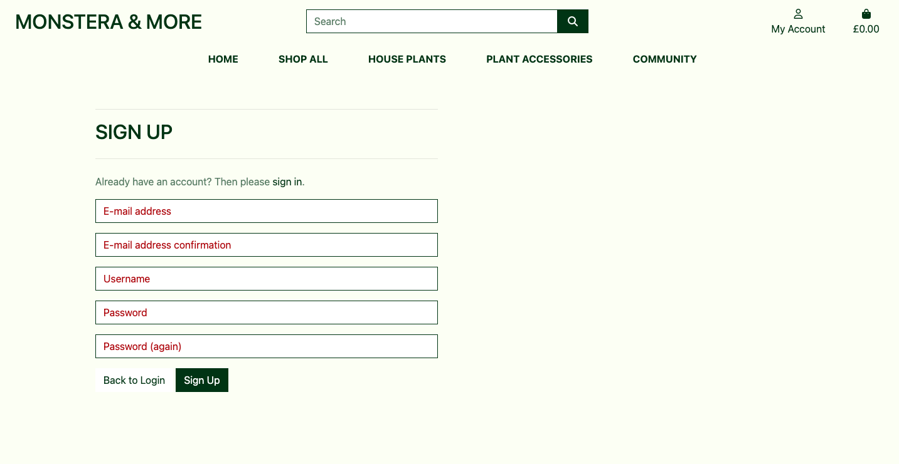

- To easily browse products, add items to my bag, checkout securely, and receive an email confirmation of my purchase.
    - The navigation bar has lots of helpful links to specific pages depending on what the user wants to browse. Once a product has been selected there is a clear button to be able to add it to the shopping bag, and a pop-up appears showing the current bag and if you want to view the bag fully. The checkout app is facilitated by Stripe which is a secure payment system. An email confirmation is sent once a user has succesfully checkout out. 

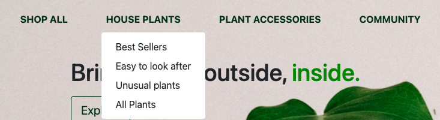
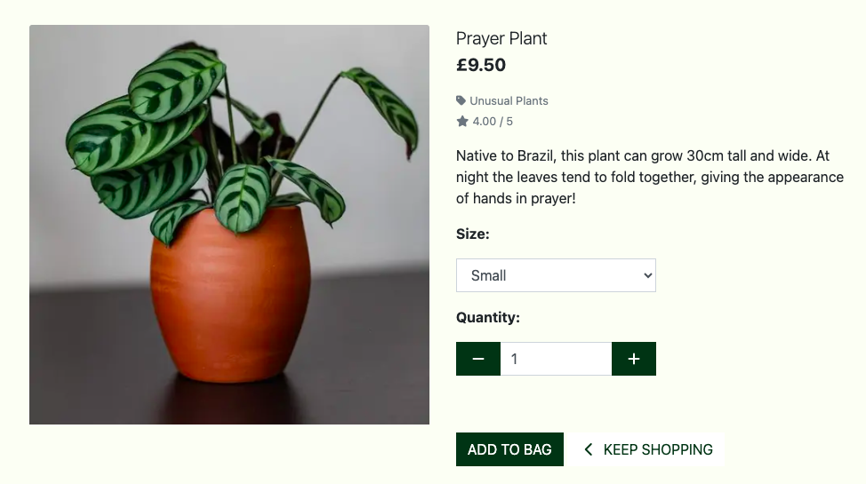
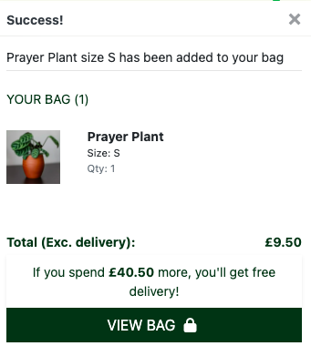
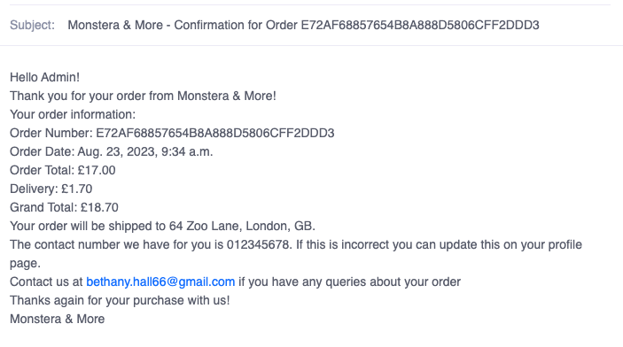

- To be able to search the site to see if a certain product is available.
    - Users can search the products on the site, it searches the title and the description of the product. If no searches are found a message will be displayed to indicate this. 

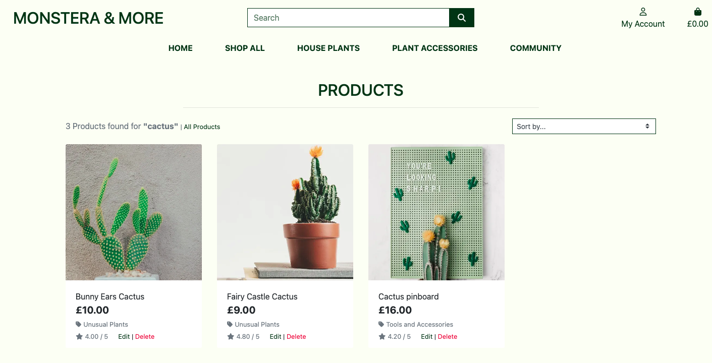

- To see if a particular product is out of stock 
    - An out of stock message is displayed if the 'in stock' field for the product is set to 'no'. media/README/us-out-of-stock.png

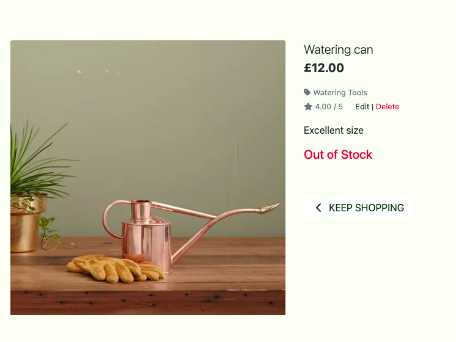

### As a returning user I want ...
- To have my details saved so that checkout is quicker.
    - If the user is logged in when checking out, their details will be saved and the form at checkout will be pre-filled. There is a tick box the user can tick if they want to save their details within the checkout form. 

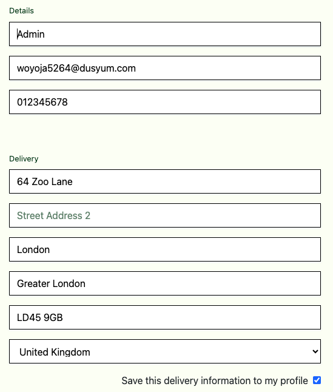

- To be able to update my details if they have changed, e.g. address.
    - A user is able to edit their details on their profile page. A success message will appear when a change has been saved. 

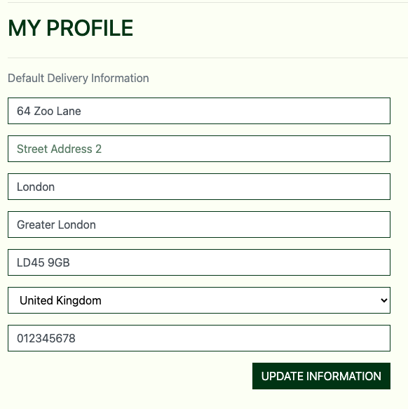
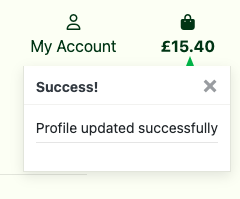

- To be able to view my order history, so if i want to order the same product again, i know exactly which one it was.
    - Within the users profile they can view their order history

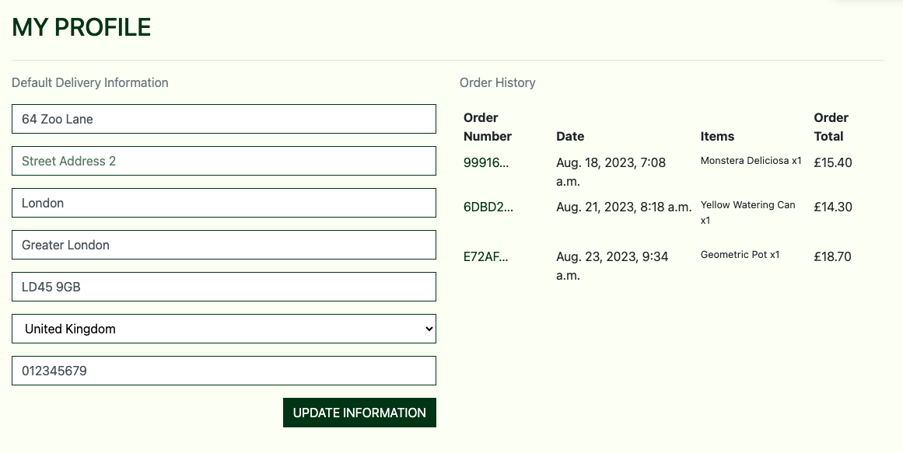

### As the site owner I want ...
- To be able to add, update and delete products.
    - Admins can add products filling out the product form shown below. They can edit and delete products from the individual product itself. Success messages are displayed for all of these actions. 

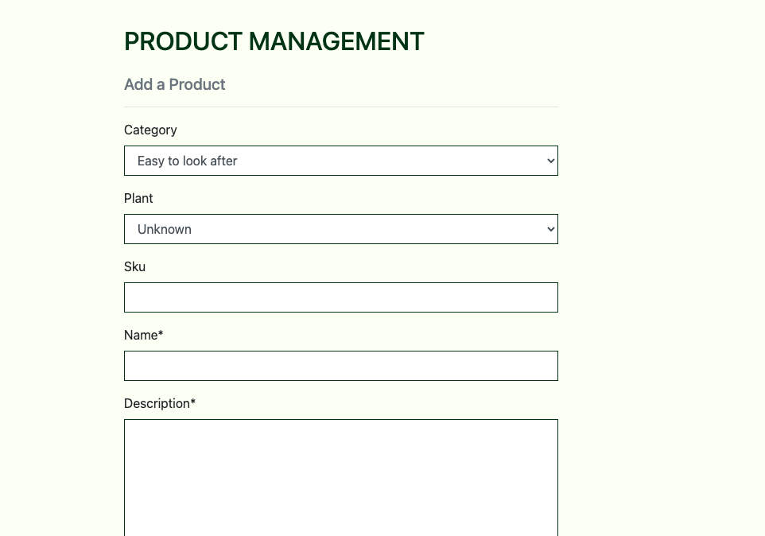
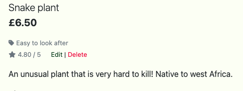
    
- Provide 404 and 500 error page to redirect users back to the homepage
    - Both 404 and 500 have been created, see a screenshot of the 404.html page below.

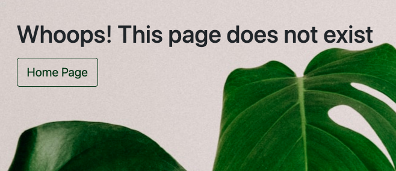

- Approve any comments or posts before they are added.
    - All comments need approving by the admin, once a commented is submitted the message shown below is displayed. 

- To attract new users and retain existing users to ultimately sell more products.
    - As this is just a concept and not a properly published site, this cannot be measured. However friends and family said they like the idea and would buy products from it if it was a real e-commerce site.

## Identified bugs
- Bug: Rating drop down within the review form was not working
    - How I fixed it: I had two return statements within the add_review function, once I realised this and combined it into one, the drop down worked.
- Bug: Each time when trying to edit a task, the cuisine would be pre-filled in the form as British, even if that is not what was previously selected when the review was added.
    - How I fixed it: I had accidentally deleted the 'selected' component within the if statment, within the edit_review file, adding this back in fixed the issue.
- Bug: Ordering reviews by date
    - How I fixed it: Initially I tried to order the reviews by date by using <code>.sort(date_visited)</code>, however this did not work as the date_visited is a string, so it was ordering it by only day (1st, 4th, 10th etc.) and not taking into account month or year. To correct this I used <code>.sort(_id) -1</code>, which then ordered the reveiws showing the most recently made reviews first.
- Bug: Footer jumping up to middle of the page when there was not content within the main section, (e.g. if a user had not yet made any reviews, this would occur on the profile page)
    - How I fixed it: I added the following CSS from Materialize documentation.
